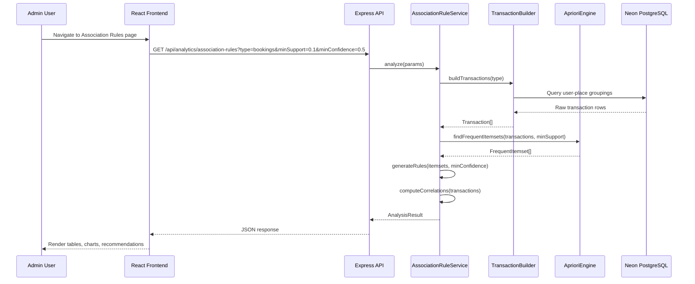
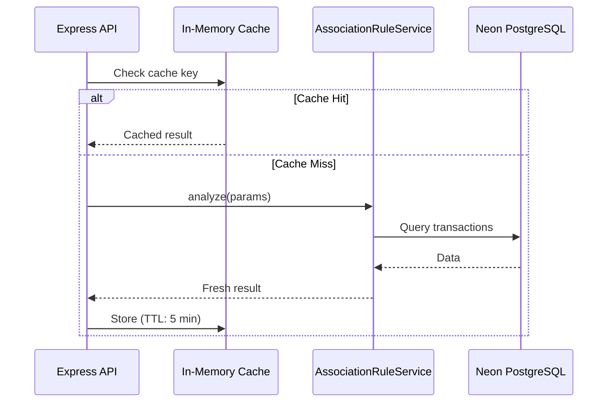

# Design Document: Association Rule Analytics

## Overview

The Association Rule Analytics feature adds Market Basket Analysis capabilities to the Lakbayan sa Kitcharao admin dashboard. It analyzes tourist behavior patterns by mining transactional data (bookings, favorites, transport requests) to discover which tourism destinations are frequently visited, booked, or favorited together. The system implements the Apriori algorithm to identify frequent itemsets, generate association rules with support/confidence/lift metrics, and present actionable business insights for destination bundling, cross-promotion, and route planning.

This feature operates entirely server-side for computation (no external ML services required) and renders results through interactive Chart.js visualizations in the existing admin dashboard. The "items" in this market basket context are tourism places/destinations, and "transactions" are user-level aggregations of bookings, favorites, or transport trips.

## Architecture

```mermaid
graph TD
    subgraph Frontend ["Admin Dashboard (React)"]
        A[AssociationRules Page] --> B[Frequent Itemsets Table]
        A --> C[Rules Table with Filters]
        A --> D[Correlation Heatmap]
        A --> E[Network Graph]
        A --> F[Bundle Recommendations]
    end

    subgraph Backend ["Express.js Server"]
        G[/api/analytics/association-rules] --> H[AssociationRuleService]
        H --> I[TransactionBuilder]
        H --> J[AprioriEngine]
        H --> K[RuleGenerator]
        H --> L[CorrelationAnalyzer]
    end

    subgraph Database ["Neon PostgreSQL"]
        M[(bookings)]
        N[(user_favorites)]
        O[(transport_requests)]
        P[(places)]
    end

    A -->|GET /api/analytics/association-rules| G
    I --> M
    I --> N
    I --> O
    J --> P
```

## Sequence Diagrams

### Main Analysis Flow



### Cache Flow



## Components and Interfaces

### Component 1: TransactionBuilder

**Purpose**: Transforms raw database records into transaction format suitable for association rule mining. Each transaction represents a single user's set of interacted places.

**Interface**:
```javascript
/**
 * @typedef {Object} Transaction
 * @property {string} userId - User identifier
 * @property {string[]} items - Array of place IDs in this transaction
 * @property {Object.<string, string>} itemNames - Map of placeId -> placeName
 */

class TransactionBuilder {
  /**
   * Build transactions from booking data
   * Groups all places booked by the same user into one transaction
   * @param {Object} options
   * @param {number} [options.minDays=0] - Only include bookings from last N days (0 = all)
   * @param {string[]} [options.statuses] - Filter by booking status
   * @returns {Promise<Transaction[]>}
   */
  async buildFromBookings(options = {})

  /**
   * Build transactions from user favorites
   * Each user's complete favorite list is one transaction
   * @returns {Promise<Transaction[]>}
   */
  async buildFromFavorites()

  /**
   * Build transactions from transport requests
   * Groups pickup/destination place correlations per user
   * @returns {Promise<Transaction[]>}
   */
  async buildFromTransport()

  /**
   * Build category-level transactions
   * Abstracts places to their categories for higher-level patterns
   * @param {string} sourceType - 'bookings' | 'favorites' | 'transport'
   * @returns {Promise<Transaction[]>}
   */
  async buildCategoryTransactions(sourceType)
}
```

**Responsibilities**:
- Query database for user-place interactions
- Group interactions by user into transaction sets
- Filter out single-item transactions (no associations possible)
- Resolve place IDs to names for display

### Component 2: AprioriEngine

**Purpose**: Implements the Apriori algorithm for frequent itemset mining. Generates candidate itemsets of increasing size, pruning those below the minimum support threshold.

**Interface**:
```javascript
/**
 * @typedef {Object} FrequentItemset
 * @property {string[]} items - Place IDs in this itemset
 * @property {number} support - Proportion of transactions containing all items (0-1)
 * @property {number} count - Absolute number of transactions containing this itemset
 */

class AprioriEngine {
  /**
   * Find all frequent itemsets above minimum support
   * @param {Transaction[]} transactions - Input transactions
   * @param {number} minSupport - Minimum support threshold (0-1)
   * @param {number} [maxSize=4] - Maximum itemset size to discover
   * @returns {FrequentItemset[]}
   */
  findFrequentItemsets(transactions, minSupport, maxSize = 4)

  /**
   * Calculate support for a specific itemset
   * @param {string[]} itemset - Items to check
   * @param {Transaction[]} transactions - Transaction dataset
   * @returns {number} Support value (0-1)
   */
  calculateSupport(itemset, transactions)
}
```

**Responsibilities**:
- Generate candidate 1-itemsets from all unique items
- Iteratively generate k+1 candidates from k-itemsets
- Prune candidates below minimum support
- Apply Apriori property (all subsets of frequent set must be frequent)
- Return sorted results by support descending

### Component 3: RuleGenerator

**Purpose**: Generates association rules from frequent itemsets and computes confidence, lift, and conviction metrics.

**Interface**:
```javascript
/**
 * @typedef {Object} AssociationRule
 * @property {string[]} antecedent - Left-hand side (IF items)
 * @property {string[]} consequent - Right-hand side (THEN items)
 * @property {number} support - Support of the full rule itemset
 * @property {number} confidence - P(consequent | antecedent)
 * @property {number} lift - confidence / P(consequent)
 * @property {number} conviction - (1 - P(consequent)) / (1 - confidence)
 */

class RuleGenerator {
  /**
   * Generate all valid association rules from frequent itemsets
   * @param {FrequentItemset[]} itemsets - Frequent itemsets from Apriori
   * @param {Transaction[]} transactions - Original transactions for metric calculation
   * @param {number} minConfidence - Minimum confidence threshold (0-1)
   * @param {number} [minLift=1.0] - Minimum lift threshold
   * @returns {AssociationRule[]}
   */
  generateRules(itemsets, transactions, minConfidence, minLift = 1.0)
}
```

**Responsibilities**:
- For each frequent itemset of size ≥ 2, generate all non-empty proper subsets as antecedents
- Compute confidence = support(A∪B) / support(A)
- Compute lift = confidence / support(B)
- Compute conviction = (1 - support(B)) / (1 - confidence)
- Filter rules below confidence and lift thresholds

### Component 4: CorrelationAnalyzer

**Purpose**: Computes pairwise correlation metrics between places/categories to identify strong positive and negative associations.

**Interface**:
```javascript
/**
 * @typedef {Object} CorrelationEntry
 * @property {string} itemA - First place/category
 * @property {string} itemB - Second place/category
 * @property {number} correlation - Phi coefficient (-1 to 1)
 * @property {number} cooccurrence - Times both appear together
 */

class CorrelationAnalyzer {
  /**
   * Compute pairwise phi coefficients for all item pairs
   * @param {Transaction[]} transactions
   * @param {number} [minOccurrence=2] - Minimum times an item must appear
   * @returns {CorrelationEntry[]}
   */
  computeCorrelations(transactions, minOccurrence = 2)

  /**
   * Build correlation matrix for heatmap visualization
   * @param {CorrelationEntry[]} correlations
   * @param {Object.<string, string>} nameMap - ID to name mapping
   * @returns {{ labels: string[], matrix: number[][] }}
   */
  buildMatrix(correlations, nameMap)
}
```

**Responsibilities**:
- Construct binary occurrence matrix from transactions
- Compute phi coefficient for each item pair
- Handle edge cases (items with zero variance)
- Format output for heatmap visualization

### Component 5: AssociationRuleService (Orchestrator)

**Purpose**: Orchestrates the full analysis pipeline and formats results for the API response.

**Interface**:
```javascript
class AssociationRuleService {
  /**
   * Run complete association rule analysis
   * @param {Object} params
   * @param {string} params.type - 'bookings' | 'favorites' | 'transport' | 'categories'
   * @param {number} params.minSupport - Minimum support (0-1), default 0.1
   * @param {number} params.minConfidence - Minimum confidence (0-1), default 0.5
   * @param {number} params.minLift - Minimum lift, default 1.0
   * @param {number} [params.maxItemsetSize=4] - Max items in a set
   * @returns {Promise<AnalysisResult>}
   */
  async analyze(params)

  /**
   * Generate bundle recommendations from rules
   * @param {AssociationRule[]} rules
   * @param {Object.<string, string>} nameMap
   * @returns {BundleRecommendation[]}
   */
  generateRecommendations(rules, nameMap)
}

/**
 * @typedef {Object} AnalysisResult
 * @property {FrequentItemset[]} frequentItemsets
 * @property {AssociationRule[]} rules
 * @property {{ labels: string[], matrix: number[][] }} correlationMatrix
 * @property {BundleRecommendation[]} recommendations
 * @property {{ totalTransactions: number, uniqueItems: number, avgTransactionSize: number }} stats
 */

/**
 * @typedef {Object} BundleRecommendation
 * @property {string[]} places - Place names to bundle
 * @property {number} confidence - How likely tourists visit all
 * @property {number} lift - How much more likely than random
 * @property {string} insight - Human-readable explanation
 */
```

## Data Models

### API Request Parameters

```javascript
// GET /api/analytics/association-rules
const requestSchema = {
  type: 'string',        // 'bookings' | 'favorites' | 'transport' | 'categories'
  minSupport: 'number',  // 0.01 - 1.0, default 0.1
  minConfidence: 'number', // 0.01 - 1.0, default 0.5
  minLift: 'number',     // >= 1.0, default 1.0
  maxSize: 'number',     // 2-6, default 4
  period: 'number'       // days to look back, 0 = all time
}
```

### API Response Shape

```javascript
const responseSchema = {
  success: true,
  data: {
    stats: {
      totalTransactions: 'number',
      uniqueItems: 'number',
      avgTransactionSize: 'number',
      totalRules: 'number',
      analysisType: 'string',
      period: 'string'
    },
    frequentItemsets: [
      {
        items: ['placeId1', 'placeId2'],
        itemNames: ['Place Name 1', 'Place Name 2'],
        support: 0.35,
        count: 12
      }
    ],
    rules: [
      {
        antecedent: ['Place A'],
        consequent: ['Place B'],
        support: 0.25,
        confidence: 0.78,
        lift: 2.1,
        conviction: 3.2
      }
    ],
    correlationMatrix: {
      labels: ['Place A', 'Place B', 'Place C'],
      matrix: [[1, 0.6, 0.2], [0.6, 1, 0.4], [0.2, 0.4, 1]]
    },
    recommendations: [
      {
        places: ['Tiktikan Lake', 'Cave Pool'],
        confidence: 0.82,
        lift: 2.5,
        insight: 'Tourists who visit Tiktikan Lake are 2.5x more likely to also visit Cave Pool'
      }
    ]
  }
}
```

**Validation Rules**:
- `minSupport` must be between 0.01 and 1.0
- `minConfidence` must be between 0.01 and 1.0
- `minLift` must be >= 1.0
- `maxSize` must be between 2 and 6
- `type` must be one of the allowed values
- `period` must be a non-negative integer

## Algorithmic Pseudocode

### Apriori Algorithm

```javascript
/**
 * ALGORITHM: Apriori Frequent Itemset Mining
 * 
 * INPUT: transactions (array of item arrays), minSupport (float 0-1), maxSize (int)
 * OUTPUT: all frequent itemsets with support >= minSupport
 * 
 * PRECONDITIONS:
 *   - transactions.length > 0
 *   - 0 < minSupport <= 1
 *   - maxSize >= 1
 * 
 * POSTCONDITIONS:
 *   - Every returned itemset has support >= minSupport
 *   - No frequent itemset above minSupport is omitted
 *   - Results sorted by support descending
 * 
 * LOOP INVARIANT:
 *   After iteration k, all frequent itemsets of size <= k have been discovered
 */
function apriori(transactions, minSupport, maxSize) {
  const n = transactions.length
  const minCount = Math.ceil(minSupport * n)
  const allFrequent = []

  // Step 1: Find frequent 1-itemsets
  const itemCounts = new Map()
  for (const tx of transactions) {
    for (const item of tx.items) {
      itemCounts.set(item, (itemCounts.get(item) || 0) + 1)
    }
  }

  let currentLevel = []
  for (const [item, count] of itemCounts) {
    if (count >= minCount) {
      currentLevel.push({ items: [item], support: count / n, count })
      allFrequent.push({ items: [item], support: count / n, count })
    }
  }

  // Step 2: Iteratively find k-itemsets from (k-1)-itemsets
  let k = 2
  while (currentLevel.length > 0 && k <= maxSize) {
    // INVARIANT: currentLevel contains all frequent (k-1)-itemsets
    const candidates = generateCandidates(currentLevel, k)
    const nextLevel = []

    for (const candidate of candidates) {
      const count = countSupport(candidate, transactions)
      if (count >= minCount) {
        const itemset = { items: candidate, support: count / n, count }
        nextLevel.push(itemset)
        allFrequent.push(itemset)
      }
    }

    currentLevel = nextLevel
    k++
  }

  return allFrequent.sort((a, b) => b.support - a.support)
}

/**
 * Generate candidate k-itemsets from frequent (k-1)-itemsets
 * Uses join step + prune step of Apriori
 */
function generateCandidates(prevLevel, k) {
  const candidates = []
  const prevItems = prevLevel.map(x => x.items)

  for (let i = 0; i < prevItems.length; i++) {
    for (let j = i + 1; j < prevItems.length; j++) {
      // Join: merge two (k-1)-itemsets that share first (k-2) items
      const merged = [...new Set([...prevItems[i], ...prevItems[j]])]
      if (merged.length === k) {
        // Prune: check all (k-1) subsets are frequent
        if (allSubsetsFrequent(merged, prevItems)) {
          candidates.push(merged.sort())
        }
      }
    }
  }

  // Deduplicate
  return deduplicateCandidates(candidates)
}
```

### Rule Generation Algorithm

```javascript
/**
 * ALGORITHM: Association Rule Generation
 * 
 * INPUT: frequentItemsets, transactions, minConfidence, minLift
 * OUTPUT: all valid association rules meeting thresholds
 * 
 * PRECONDITIONS:
 *   - frequentItemsets are valid (all above minSupport)
 *   - 0 < minConfidence <= 1
 *   - minLift >= 1.0
 * 
 * POSTCONDITIONS:
 *   - Every returned rule has confidence >= minConfidence AND lift >= minLift
 *   - For each rule A → B: A ∩ B = ∅ and A ∪ B is a frequent itemset
 */
function generateRules(frequentItemsets, transactions, minConfidence, minLift) {
  const n = transactions.length
  const rules = []
  const supportMap = buildSupportMap(frequentItemsets)

  for (const itemset of frequentItemsets) {
    if (itemset.items.length < 2) continue

    const subsets = getNonEmptyProperSubsets(itemset.items)

    for (const antecedent of subsets) {
      const consequent = itemset.items.filter(x => !antecedent.includes(x))
      if (consequent.length === 0) continue

      const supportAB = itemset.support
      const supportA = supportMap.get(antecedent.sort().join(','))
      const supportB = supportMap.get(consequent.sort().join(','))

      if (!supportA || !supportB) continue

      const confidence = supportAB / supportA
      const lift = confidence / supportB
      const conviction = supportB === 1 ? Infinity : (1 - supportB) / (1 - confidence)

      if (confidence >= minConfidence && lift >= minLift) {
        rules.push({ antecedent, consequent, support: supportAB, confidence, lift, conviction })
      }
    }
  }

  return rules.sort((a, b) => b.lift - a.lift)
}
```

### Phi Coefficient Correlation

```javascript
/**
 * ALGORITHM: Phi Coefficient for Binary Variables
 * 
 * INPUT: transactions array
 * OUTPUT: pairwise phi coefficients for all item pairs
 * 
 * PRECONDITIONS:
 *   - transactions.length >= 2
 *   - Each transaction has at least 1 item
 * 
 * POSTCONDITIONS:
 *   - phi(A,B) is in range [-1, 1]
 *   - phi(A,B) = phi(B,A) (symmetric)
 *   - phi = 1 implies perfect positive correlation
 *   - phi = 0 implies no correlation
 *   - phi = -1 implies perfect negative correlation
 */
function computePhiCoefficient(transactions, itemA, itemB) {
  const n = transactions.length
  let n11 = 0, n10 = 0, n01 = 0, n00 = 0

  for (const tx of transactions) {
    const hasA = tx.items.includes(itemA)
    const hasB = tx.items.includes(itemB)
    if (hasA && hasB) n11++
    else if (hasA && !hasB) n10++
    else if (!hasA && hasB) n01++
    else n00++
  }

  const numerator = (n11 * n00) - (n10 * n01)
  const denominator = Math.sqrt((n11 + n10) * (n01 + n00) * (n11 + n01) * (n10 + n00))

  if (denominator === 0) return 0
  return numerator / denominator
}
```

## Key Functions with Formal Specifications

### Function: buildFromBookings()

```javascript
async buildFromBookings({ minDays = 0, statuses = ['confirmed', 'completed'] })
```

**Preconditions:**
- Database connection is available
- `statuses` contains valid booking status values
- `minDays` is a non-negative integer

**Postconditions:**
- Returns Transaction[] where each transaction has items.length >= 2
- Each transaction.userId is unique (one transaction per user)
- All place IDs in items exist in the places table
- If minDays > 0, only bookings within that window are included

**Loop Invariants:** N/A (single SQL query with GROUP BY)

### Function: findFrequentItemsets()

```javascript
findFrequentItemsets(transactions, minSupport, maxSize = 4)
```

**Preconditions:**
- `transactions.length > 0`
- `0 < minSupport <= 1`
- `2 <= maxSize <= 6`

**Postconditions:**
- Every returned itemset satisfies: itemset.support >= minSupport
- Every returned itemset satisfies: itemset.items.length <= maxSize
- No frequent itemset of size <= maxSize is omitted (completeness)
- For any returned itemset of size k, all its (k-1)-subsets are also in the result

**Loop Invariants:**
- After iteration k: `currentLevel` contains exactly all frequent k-itemsets
- `allFrequent` contains all frequent itemsets of size 1..k

### Function: generateRules()

```javascript
generateRules(itemsets, transactions, minConfidence, minLift = 1.0)
```

**Preconditions:**
- `itemsets` are valid frequent itemsets (all above some minSupport)
- `transactions.length > 0`
- `0 < minConfidence <= 1`
- `minLift >= 1.0`

**Postconditions:**
- For every rule: `rule.confidence >= minConfidence`
- For every rule: `rule.lift >= minLift`
- For every rule: `rule.antecedent ∩ rule.consequent = ∅`
- For every rule: `rule.support = support(antecedent ∪ consequent)`
- Rules are sorted by lift descending

**Loop Invariants:**
- At each iteration, the current itemset's antecedent/consequent partition is valid

## Example Usage

```javascript
// Backend: API route handler
router.get('/association-rules', protect, authorize('admin'), async (req, res) => {
  const { type = 'bookings', minSupport = 0.1, minConfidence = 0.5, minLift = 1.0, maxSize = 4, period = 0 } = req.query

  const cacheKey = `assoc:${type}:${minSupport}:${minConfidence}:${period}`
  const cached = getCached(cacheKey)
  if (cached) return res.json({ success: true, data: cached })

  const service = new AssociationRuleService()
  const result = await service.analyze({
    type,
    minSupport: parseFloat(minSupport),
    minConfidence: parseFloat(minConfidence),
    minLift: parseFloat(minLift),
    maxItemsetSize: parseInt(maxSize),
    period: parseInt(period)
  })

  setCache(cacheKey, result, 300000) // 5 min cache
  res.json({ success: true, data: result })
})

// Frontend: Fetching and displaying results
const fetchAssociationRules = async (params) => {
  const { data } = await api.get('/analytics/association-rules', { params })
  return data.data
}

// Example output for a small dataset:
// {
//   stats: { totalTransactions: 45, uniqueItems: 12, avgTransactionSize: 3.2, totalRules: 8 },
//   frequentItemsets: [
//     { items: ['id1', 'id2'], itemNames: ['Tiktikan Lake', 'Cave Pool'], support: 0.42, count: 19 },
//     { items: ['id3', 'id4'], itemNames: ['Falls', 'Hot Spring'], support: 0.33, count: 15 }
//   ],
//   rules: [
//     { antecedent: ['Tiktikan Lake'], consequent: ['Cave Pool'], support: 0.42, confidence: 0.82, lift: 2.5, conviction: 3.1 }
//   ],
//   recommendations: [
//     { places: ['Tiktikan Lake', 'Cave Pool'], confidence: 0.82, lift: 2.5, insight: 'Tourists who visit Tiktikan Lake are 2.5x more likely to also visit Cave Pool. Consider bundling these as a day tour.' }
//   ]
// }
```

## Correctness Properties

*A property is a characteristic or behavior that should hold true across all valid executions of a system-essentially, a formal statement about what the system should do. Properties serve as the bridge between human-readable specifications and machine-verifiable correctness guarantees.*

### Property 1: Support Monotonicity (Apriori Property)

*For any* set of transactions and any minSupport threshold, for every frequent itemset S returned by the Apriori_Engine, all subsets of S must also appear in the result with support greater than or equal to support(S).

**Validates: Requirements 3.1, 3.3**

### Property 2: Rule Metric Correctness

*For any* set of frequent itemsets and transactions, for every rule A→B generated by the Rule_Generator, confidence must equal support(A∪B) / support(A), lift must equal confidence / support(B), and conviction must equal (1 - support(B)) / (1 - confidence).

**Validates: Requirements 4.2, 4.3, 4.4**

### Property 3: Rule Threshold Filtering

*For any* set of generated rules, every rule must satisfy confidence >= minConfidence AND lift >= minLift, and antecedent and consequent must be disjoint sets.

**Validates: Requirements 4.5, 4.6**

### Property 4: Transaction Invariants

*For any* input data and analysis type, the Transaction_Builder output must contain at most one transaction per user, and every transaction must contain at least 2 items.

**Validates: Requirements 2.5, 2.6**

### Property 5: Correlation Matrix Validity

*For any* set of transactions, the correlation matrix produced by the Correlation_Analyzer must be symmetric (matrix[i][j] = matrix[j][i]), have diagonal values equal to 1, and all phi values must be in the range [-1, 1].

**Validates: Requirements 5.2, 5.3, 5.4**

### Property 6: Support Symmetry Across Rules

*For any* two rules A→B and B→A generated from the same itemset, the support values must be equal (support is symmetric even though confidence and lift are not).

**Validates: Requirement 4.2**

### Property 7: Input Validation Rejection

*For any* parameter values outside the valid ranges (minSupport outside [0.01, 1.0], minConfidence outside [0.01, 1.0], minLift < 1.0, maxSize outside [2, 6], invalid type, or negative period), the API_Endpoint must reject the request with HTTP 400.

**Validates: Requirements 7.1, 7.2, 7.3, 7.4, 7.5, 7.6**

### Property 8: Itemset Support Accuracy

*For any* set of transactions and returned frequent itemsets, the reported support value for each itemset must equal the actual count of transactions containing all items in the itemset divided by total transaction count.

**Validates: Requirement 3.1**

### Property 9: Recommendation Completeness

*For any* set of generated recommendations, each recommendation must contain place names, confidence value, lift value, and an insight string that references the lift magnitude and place names.

**Validates: Requirements 9.2, 9.3**

### Property 10: Cache Key Determinism

*For any* combination of request parameters (type, minSupport, minConfidence, period), the same parameters must always produce the same cache key, and different parameters must produce different cache keys.

**Validates: Requirement 8.3**

## Error Handling

### Error Scenario 1: Insufficient Data

**Condition**: Fewer than 3 transactions available for the selected analysis type
**Response**: Return success with empty results and a `warning` field explaining insufficient data
**Recovery**: Suggest trying a different analysis type or broader time period

### Error Scenario 2: No Frequent Itemsets Found

**Condition**: minSupport threshold is too high for the dataset
**Response**: Return empty itemsets/rules with suggestion to lower minSupport
**Recovery**: Include `suggestedMinSupport` value (half of current) in response

### Error Scenario 3: Database Query Timeout

**Condition**: Transaction building query exceeds 30s (large dataset)
**Response**: Return HTTP 504 with message suggesting narrower time period
**Recovery**: Leverage existing retry logic in neon.js; suggest reducing `period` parameter

### Error Scenario 4: Invalid Parameters

**Condition**: Request parameters outside valid ranges
**Response**: Return HTTP 400 with specific validation error messages
**Recovery**: Include parameter constraints in error response for frontend guidance

## Testing Strategy

### Unit Testing Approach

- Test AprioriEngine with known small datasets where expected itemsets can be manually verified
- Test RuleGenerator with pre-computed support values
- Test CorrelationAnalyzer with simple 2x2 contingency tables
- Test TransactionBuilder SQL output with mock database responses
- Verify edge cases: empty transactions, single-item transactions, all-same-items

### Property-Based Testing Approach

**Property Test Library**: fast-check

- **Apriori monotonicity**: For any generated frequent itemset, verify all subsets are also in the result
- **Confidence range**: For any generated rule, verify 0 < confidence <= 1
- **Support consistency**: For any rule A→B, verify support(A→B) <= support(A) and support(A→B) <= support(B)
- **Phi symmetry**: For generated correlation matrix, verify matrix[i][j] === matrix[j][i]

### Integration Testing Approach

- Seed test database with known booking/favorite patterns
- Verify end-to-end API response contains expected rules for planted patterns
- Test caching behavior (second request hits cache, invalidation works)
- Test admin authorization (non-admin users receive 403)

## Performance Considerations

- **Caching**: Results cached for 5 minutes using existing `setCache`/`getCached` in neon.js (association mining is computationally expensive but data changes infrequently)
- **Query Optimization**: Transaction building uses single GROUP BY query with array_agg, avoiding N+1 queries
- **Itemset Size Limit**: maxSize capped at 6 to prevent combinatorial explosion (2^n subsets)
- **Early Termination**: If no frequent k-itemsets found, stop immediately (no k+1 candidates possible)
- **Minimum Transaction Filter**: Exclude transactions with < 2 items at the SQL level to reduce data transfer
- **Pagination**: Frontend displays top 50 rules by default with client-side filtering

## Security Considerations

- All endpoints require JWT authentication + admin role authorization (existing `protect` + `authorize('admin')` middleware)
- Input validation on all query parameters to prevent injection
- No raw SQL interpolation (parameterized queries via existing `queryAll`)
- Rate limiting already applied via existing express-rate-limit middleware
- No sensitive user data exposed in results (only aggregated patterns, place names)

## Dependencies

- **Existing (no new packages needed)**:
  - `pg` (Neon PostgreSQL queries)
  - `express` (routing)
  - `jsonwebtoken` / auth middleware (access control)
  - `chart.js` + `react-chartjs-2` (frontend charts)
  - `react-hot-toast` (notifications)
  - `framer-motion` (animations)

- **No external ML libraries required** - Apriori algorithm implemented in pure JavaScript server-side (dataset sizes for a municipal tourism platform are small enough for in-memory processing)
